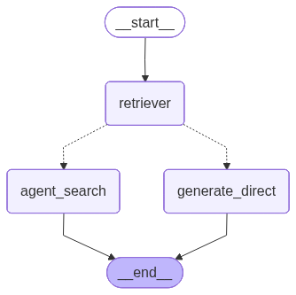

# 🤖 AgenticRAGChat : Système RAG Agentique et Conversationnel Personnalisable

AgenticRAGChat est une application web construite avec Streamlit qui permet de créer un assistant conversationnel intelligent et personnalisé. L'utilisateur peut fournir ses propres sources de connaissances (URLs, texte brut, ou fichiers PDF) pour construire un système de Récupération Augmentée par la Génération (RAG) avec lequel il peut ensuite dialoguer.

Le système est **"agentique"**, ce qui signifie que si l'information n'est pas trouvée dans les documents fournis, il peut de manière autonome chercher des réponses sur le web en utilisant des outils comme Tavily, Wikipedia ou Arxiv.

## 🚀 Fonctionnalités Clés

- **Multi-Source d'Information** : Importez vos connaissances via des URLs, du texte brut ou en téléversant plusieurs fichiers PDF simultanément.

- **Construction à la Demande** : Initialisez le système RAG en un clic après avoir fourni vos documents. L'interface affiche la progression du traitement et de l'indexation.

- **Interface de Chat Intuitive** : Une fois le système construit, dialoguez avec vos documents de manière naturelle. L'historique de la conversation est conservé pendant la session.

- **Agent de type ReAct** : L'agent utilise un framework de Raisonnement et d'Action (ReAct) pour décomposer les questions complexes, choisir les bons outils (recherche documentaire, recherche web) et formuler une réponse finale cohérente.

- **Capacités Agentiques** : Si une question ne peut pas être répondue à partir des documents, l'agent peut automatiquement utiliser des outils de recherche web pour trouver l'information manquante et fournir une réponse complète.

- **Transparence et Débogage** : Une section dédiée permet de tester directement le "retriever" pour voir quels fragments de texte sont jugés les plus pertinents pour une requête donnée, aidant à comprendre le raisonnement du système.

- **Design Moderne et Épuré** : L'interface utilisateur est conçue pour être claire, professionnelle et facile à utiliser.

## 🏛️ Architecture du Projet

Le projet est structuré de manière modulaire pour séparer les différentes responsabilités, ce qui le rend facile à maintenir et à étendre.

```
AgenticRAGChat/
├── streamlit_app.py                    # Point d'entrée de l'application
├── src/
│   ├── config/
│   │   └── config.py                   # Configuration centralisée
│   ├── document_ingestion/
│   │   └── document_processor.py       # Traitement des documents
│   ├── vectorstore/
│   │   └── vectorstore.py             # Base de données vectorielle
│   └── graph_builder/
│       └── graph_builder.py           # Construction du graphe LangGraph
├── requirements.txt                    # Dépendances Python
├── .env                               # Variables d'environnement
└── README.md
```

### Description des modules

- **`streamlit_app.py`** : Le point d'entrée de l'application. Il gère l'interface utilisateur, l'état de la session et orchestre les appels aux différents modules du backend.

- **`src/`** : Ce répertoire contient toute la logique principale du système RAG.
  - **`config/config.py`** : Centralise la configuration, comme les clés d'API, les noms de modèles et d'autres paramètres.
  - **`document_ingestion/document_processor.py`** : Gère la division des documents bruts en plus petits fragments (chunks) prêts à être vectorisés.
  - **`vectorstore/vectorstore.py`** : Responsable de la création de la base de données vectorielle (ex: FAISS ou ChromaDB) et de l'initialisation du retriever.
  - **`graph_builder/graph_builder.py`** : Construit le graphe de conversation avec LangGraph, définissant la logique de l'agent (comment il doit récupérer des informations, générer des réponses et utiliser des outils).

## 📊 Diagramme du Graphe de l'Agent

Voici une visualisation du flux de travail de l'agent, générée avec LangGraph.

*(Remplacez cette ligne par votre image en utilisant la syntaxe Markdown : )*

## 🤖 Modèles et Composants Techniques

- **Framework UI** : Streamlit
- **Orchestration** : LangGraph pour construire le flux de l'agent
- **Fournisseur de LLM** : Groq (configurable via `src/config/config.py`)
- **Modèle d'Embedding** : Hugging Face (ex: `sentence-transformers/all-MiniLM-L6-v2`)
- **Base de Données Vectorielle** : Configurable, compatible avec FAISS, ChromaDB, etc.
- **Outils de Recherche Web** : Tavily, Wikipedia, Arxiv (intégrés dans le graphe de l'agent)

## 🌐 Application en Ligne

Vous pouvez tester l'application déployée directement ici :

**[🚀 Accéder à AgenticRAGChat](#)** *(https://agentic-rag-with-react-agent.streamlit.app/)*

## ⚙️ Flux de Travail de l'Utilisateur

1. **Lancer l'Application** : L'utilisateur arrive sur un écran d'accueil.

2. **Importer les Sources** : Dans la barre latérale, l'utilisateur ajoute des URLs, colle du texte ou téléverse des fichiers PDF.

3. **Construire le Système** : L'utilisateur clique sur le bouton "Lancer la construction". L'application traite tous les documents, les divise en fragments, les vectorise et construit le graphe de l'agent RAG.

4. **Dialoguer** : Une fois le système prêt, la zone de chat principale apparaît. L'utilisateur peut poser des questions.

5. **Obtenir des Réponses** : L'agent cherche d'abord dans les documents fournis. S'il ne trouve pas de réponse satisfaisante, il utilise ses outils pour chercher sur le web, puis génère une réponse finale basée sur toutes les informations collectées.

## 🛠️ Installation et Utilisation

### Prérequis

- Python 3.10+
- Un gestionnaire d'environnement comme `venv` ou `conda`

### 1. Cloner le Dépôt

```bash
git clone <URL_DU_DEPOT>
cd <NOM_DU_DEPOT>
```

### 2. Créer un Environnement Virtuel et Installer les Dépendances

```bash
# Créer l'environnement
python -m venv venv

# Activer l'environnement
source venv/bin/activate  # Sur Windows: venv\Scripts\activate

# Installer les paquets
pip install -r requirements.txt
```

### 3. Configurer les Variables d'Environnement

Créez un fichier `.env` à la racine du projet et ajoutez vos clés d'API :

```bash
# .env
GROQ_API_KEY="gsk_..."
TAVILY_API_KEY="tvly-..."
LANGCHAIN_API_KEY="ls_..."  # Recommandé pour le suivi avec LangSmith
```

### 4. Lancer l'Application

```bash
streamlit run streamlit_app.py
```

Ouvrez votre navigateur à l'adresse `http://localhost:8501`. Vous pouvez maintenant commencer à construire votre propre assistant RAG !

## 🔧 Fonctionnalités Avancées

### Test du Retriever

Deux méthodes pour tester la récupération de documents :

**Via la barre latérale :**
1. Entrez votre requête dans la section "Tester le retriever"
2. Cliquez sur "Tester"
3. Visualisez les documents récupérés avec leurs scores

**Via le chat :**
```
/test-retriever donner un papier
```

### Diagnostics Système

Cliquez sur "🔧 Diagnostics système" pour vérifier la configuration de votre système et détecter d'éventuels problèmes de performance.

### Commandes du Chat

- `/test-retriever <requête>` : Test direct du retriever
- Questions normales : Traitement RAG complet avec recherche web si nécessaire

## 📦 Requirements.txt

```txt
streamlit>=1.28.0
pypdf>=3.15.0
langchain>=0.1.0
langchain-community>=0.0.20
langchain-core>=0.1.0
groq>=0.4.0
langchain-groq>=0.0.1
faiss-cpu>=1.7.4
sentence-transformers>=2.2.0
tavily-python>=0.3.0
wikipedia>=1.4.0
arxiv>=1.4.0
python-dotenv>=1.0.0
```

## 🔧 Dépannage

### Problèmes de File Watcher

Si vous rencontrez des erreurs liées au file watching :

```bash
# Augmenter les limites inotify (Linux)
echo 8192 | sudo tee /proc/sys/fs/inotify/max_user_instances
echo 524288 | sudo tee /proc/sys/fs/inotify/max_user_watches

# Ou désactiver le file watcher
export DISABLE_STREAMLIT_WATCHER=true
```

### Erreurs d'Importation

Vérifiez que tous les modules sont installés :

```bash
pip install -r requirements.txt
```

## 📚 Documentation Technique

### Configuration

Le fichier `src/config/config.py` centralise toute la configuration :

- **Clés d'API** : Groq, Tavily, LangChain
- **Paramètres de chunking** : `CHUNK_SIZE`, `CHUNK_OVERLAP`
- **Modèles** : LLM et embeddings
- **Paramètres du retriever**

### Personnalisation

Le système est conçu pour être facilement extensible :

- **Ajout de nouveaux outils** : Modifiez `graph_builder.py`
- **Changement de LLM** : Configurez dans `config.py`
- **Personnalisation de l'UI** : Modifiez le CSS dans `streamlit_app.py`

## 🤝 Contribution

Les contributions sont les bienvenues ! Pour contribuer :

1. Fork le projet
2. Créer une branche pour votre fonctionnalité (`git checkout -b feature/AmazingFeature`)
3. Commiter vos changements (`git commit -m 'Add some AmazingFeature'`)
4. Pousser vers la branche (`git push origin feature/AmazingFeature`)
5. Ouvrir une Pull Request

## 📄 Licence

Ce projet est sous licence MIT. Voir le fichier `LICENSE` pour plus de détails.

## 🆘 Support

- **Diagnostics intégrés** : Utilisez les outils de diagnostic dans l'application
- **Logs** : Consultez la console Streamlit pour les détails techniques
- **Issues** : Créez une issue sur le repository pour signaler des bugs
- **Documentation** : Consultez ce README pour les instructions détaillées

## 🎯 Roadmap

- [ ] Support de plus de formats de fichiers (Word, PowerPoint)
- [ ] Interface multi-utilisateurs avec authentification
- [ ] API REST pour intégration externe
- [ ] Support de bases de données vectorielles cloud
- [ ] Amélioration des capacités de recherche web
- [ ] Interface mobile optimisée

---

**🚀 Créé avec Streamlit, LangGraph, et beaucoup de ☕**

*AgenticRAGChat - Transformez vos documents en assistants conversationnels intelligents*
